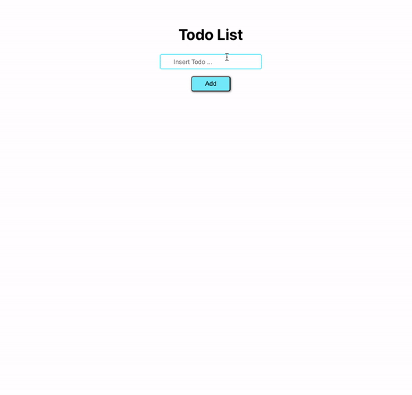

> ##  Simple TODO app using redux and react-redux 📦

### To run the app type
>  "`npm start`" <strong> from </strong> "`root directory`" 

 
Open [http://localhost:3000](http://localhost:3000) to view it in the browser.

